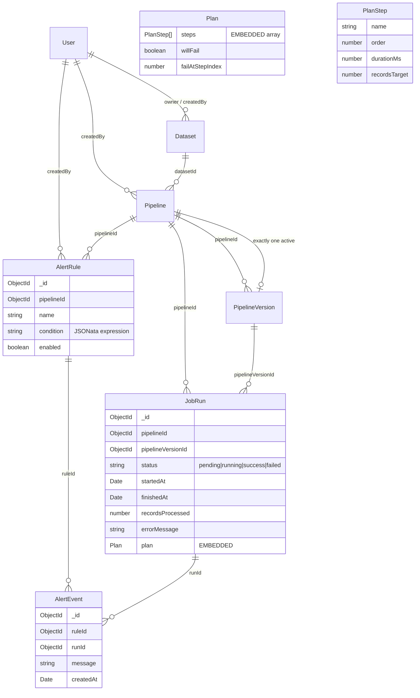

# Data model

MongoDB collections and their relationships. Modeling rule of thumb: data
read together is embedded; data referenced from many places is its own
collection (see ADR-0003 for run plan, ADR-0005 for alert events).

## Embedded vs referenced — the choices

- **`Plan` is embedded inside `JobRun`.** The plan is sampled once at run
  start (`samplePlan`) and never read outside the context of its run. There
  is no cross-run query that needs to filter on plan steps. Embedding makes
  the run document self-contained and keeps materialization a pure function
  of one document.
- **`AlertEvent` is its own collection.** Events are listed across all runs
  on `/alerts`, deduplicated via the unique `(ruleId, runId)` index, and
  drive the `alertFired` event in the bus. Embedding them inside `JobRun`
  would make cross-run listing awkward and the unique index impossible.
- **`PipelineVersion` is its own collection** (ADR-0002). Versions are
  immutable snapshots; embedding them inside `Pipeline` would force the
  pipeline document to grow unboundedly.
- **No separate `JobRunStep` collection.** The materialized step state is
  derived from `Plan` + `now()` (ADR-0003) and never persisted. An earlier
  draft of the schema had a `JobRunStep` collection; it was removed because
  it was written but never read.
