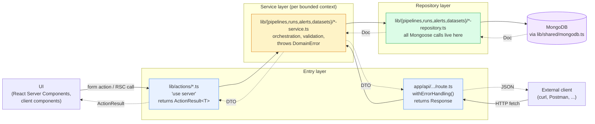

# Layered request flow

How a single request travels from a client to MongoDB and back. Two entry
points share one core (ADR-0001).

## Why two entry points?

- **Server Actions** (`lib/actions/`) are optimal for the UI: no JSON
  roundtrip on form submits, native `revalidatePath` for cache busting, and
  `ActionResult<T>` shapes errors instead of throwing across the boundary.
- **REST routes** (`app/api/`) are the *behavioural contract* of the
  service. External clients depend on them; the assignment requires them.

Both are thin adapters. All domain logic — validation rules, error mapping,
business invariants — lives in services. This is enforced by `lib/shared/`
boundaries: `errors.ts`, `errors-to-result.ts`, and `with-error-handling.ts`
together ensure that whichever entry point is used, errors are normalized
identically.

## Server boundary

`lib/{pipelines,runs,alerts,datasets,events}/index.ts` and
`lib/shared/{mongodb,realtime}.ts` import `'server-only'`. This is a build-
time guard against accidentally bundling Mongoose or the event bus into a
client component.
